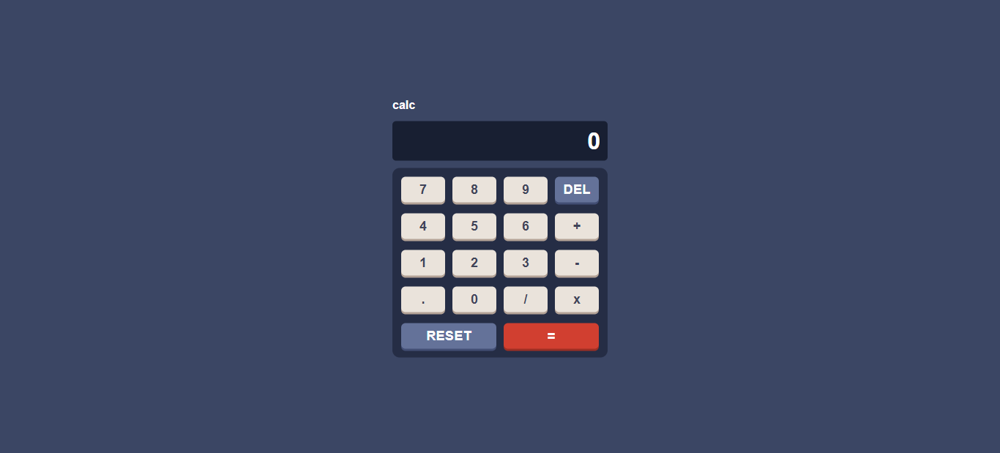

# React Calculator App

## Table of Contents
- [Introduction](#introduction)
- [Getting Started](#getting-started)
  - [Prerequisites](#prerequisites)
  - [Installation](#installation)
- [Usage](#usage)
- [Features](#features)
- [Contributing](#contributing)
- [License](#license)
- [Acknowledgments](#acknowledgments)

## Introduction

The React Calculator App is a web application developed using React.js. It provides a user-friendly interface for performing basic mathematical operations such as addition, subtraction, multiplication, and division. Whether you're a student looking for a simple calculator or just need to do some quick math, this app has you covered.



## Getting Started

These instructions will help you set up and run the project on your local machine for development and testing purposes.

### Prerequisites

Before you begin, ensure you have met the following requirements:

- **Node.js**: Make sure you have Node.js installed. You can download it from [nodejs.org](https://nodejs.org/).

### Installation

1. Clone the project:

   ```shell
   git clone https://github.com/varshad9706/react-calculator.git
   ```

2. Navigate to the project directory:

   ```shell
   cd react-calculator
   ```

3. Install the dependencies:

   ```shell
   npm install
   ```

   or

   ```shell
   yarn install
   ```

4. Start the application:

   ```shell
   npm start
   ```

   or

   ```shell
   yarn start
   ```

   This command will start the development server, and the app will open in your default web browser.

## Usage

Once the application is running, you will see the calculator interface. Use the buttons to input numbers and perform calculations. The app supports addition, subtraction, multiplication, and division.

## Features

- User-friendly interface
- Basic arithmetic operations
- Clear button for easy input correction
- Real-time calculation display
- Responsive design for various screen sizes

## Contributing

Contributions are welcome! If you find any bugs or have ideas for new features, please open an issue or submit a pull request. We appreciate your feedback and contributions to make this project better.

## License

This project is licensed under the MIT License - see the [LICENSE](LICENSE) file for details.

## Acknowledgments

We would like to thank the React.js community for their excellent documentation and the open-source contributors who have made building this app possible.

